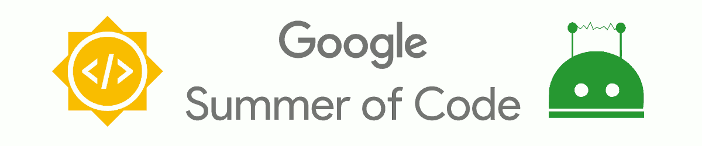

# GSoC 2021 Wechaty Ideas Page

This page aggregates project ideas for Google Summer of Code 2021. See more information about this project and applications on the [Wechaty Google Summer of Code page](../).

## Introduction

Below you can find project ideas which have been proposed for this year. New ideas may be proposed by interested mentors or students. Project ideas without potential mentors will be considered though applicants may need to work with the community and GSoC org admins to find mentors. To add a new project idea, see: [proposing project ideas](../proposing-project-ideas.md) .

### Learn more from Community

Join Gitter
Review Meeting Notes
Read Docs
Play with Wechaty Getting Started

### The List

We have the following three lists in this Ideas Page:

1. **Accepted Project Ideas**: Accepted by the GSoC program
1. **Draft Ideas**: Accepted by the community
1. **Ongoing Discussions**: Proposed from the community

## ACCEPTED PROJECT IDEAS

Below you can see the list of project ideas that fully match the Wechaty' project idea standard. The scope of these ideas is well known and we don't normally expect deep changes. All ideas have quick start guidelines and newbie-frienfly issues referenced. We welcome contributors to join the mentor teams, and we invite students to submit project proposal applications in relation to these ideas.

-----

## DRAFT PROJECT IDEAS

Below you can see draft project ideas, which are currently under review. The scope of such ideas may change during the discussions, but the idea is accepted in principle. You are welcome to comment on the draft and to join the project as a mentor. If you are a student, it is also fine to explore and to apply to the draft project ideas.

### [Project: Enhance Whatsapp Puppet #32](https://github.com/wechaty/summer-of-wechaty/issues/32)

We want Wechaty to be the universal instant messaging SDK on all IM platforms for chatbot makers to build their great conversational user interface, so while these are our ideas of what we think would make good projects for the summer, we're eager to hear your ideas and proposals as well.

Enhance Whatsapp Puppet <https://github.com/wechaty/wechaty-puppet-whatsapp>. The Puppet abstraction allows Wechaty to provide a consisting API on all IM platforms for build a chatbot. We are supporting Whatsapp already, however, the Wahtsapp support is very limited. We want to implement more functions so that our developers can run their chatbots on Whatsapp to perform as much as action we can.

- **Potential Mentor(s)**: [Huan](https://wechaty.js.org/contributors/huan), [@treeguard](https://github.com/treeguard), [Shan](https://wechaty.js.org/contributors/univerone/)
- **Category**: Core development
- **Skills Required**: TypeScript programming language, [whatsapp-web.js](https://github.com/pedroslopez/whatsapp-web.js/).
- **Difficulty Level**: Medium

-----

### [Project: Implement "Twitter" Puppet #33](https://github.com/wechaty/summer-of-wechaty/issues/33)

We want Wechaty to be the universal instant messaging SDK on all IM platforms for chatbot makers to build their great conversational user interface, so while these are our ideas of what we think would make good projects for the summer, we're eager to hear your ideas and proposals as well.

Implement **Twitter Puppet**. The Puppet abstraction allows Wechaty to provide a consisting API on all IM platforms for build a chatbot. We are supporting WeChat, WeCom, Whatsapp already, and we want to support Twitter so that our developers can run their chatbots on Twitter to serve users from Twitter.

- **Potential Mentor(s)**: [Huan](https://wechaty.js.org/contributors/huan)
- **Category**: Core development
- **Skills Required**: TypeScript programming language, Twitter API
- **Difficulty Level**: Medium

-----

### [Project: Implement "Twilio" Puppet #34](https://github.com/wechaty/summer-of-wechaty/issues/34)

We want Wechaty to be the universal instant messaging SDK on all IM platforms for chatbot makers to build their great conversational user interface, so while these are our ideas of what we think would make good projects for the summer, we're eager to hear your ideas and proposals as well.

Implement **Twilio** Puppet. The Puppet abstraction allows Wechaty to provide a consisting API on all IM platforms for build a chatbot. We are supporting WeChat, WeCom, Whatsapp already, and we want to support Twilio so that our developers can run their chatbots on SMS/MMS to serve users from the phone messaging.

- **Potential Mentor(s)**: [Huan](https://wechaty.js.org/contributors/huan)
- **Category**: Core development
- **Skills Required**: TypeScript programming language, Twilio API
- **Difficulty Level**: Medium

-----

### [Project: Implement "Teams" Puppet #35](https://github.com/wechaty/summer-of-wechaty/issues/35)

We want Wechaty to be the universal instant messaging SDK on all IM platforms for chatbot makers to build their great conversational user interface, so while these are our ideas of what we think would make good projects for the summer, we're eager to hear your ideas and proposals as well.

Implement **Teams** Puppet. The Puppet abstraction allows Wechaty to provide a consisting API on all IM platforms for build a chatbot. We are supporting WeChat, WeCom, Whatsapp already, and we want to support Teams so that our developers can run their chatbots on company teams to serve users from the chatting and meeting.

- **Potential Mentor(s)**: [@wj-Mcat](https://wechaty.js.org/contributors/wj-mcat)
- **Category**: Core development
- **Skills Required**: TypeScript programming language, Teams Bot API
- **Difficulty Level**: Medium

-----

### [Project: Implement Wechaty Rasa Plugin #36](https://github.com/wechaty/summer-of-wechaty/issues/36)

[Rasa](https://github.com/RasaHQ/rasa) is a popular task-oriented dialogue system which can be a pipeline in IM platform. What's more, wechaty is an unifiy conversation AI SDK for chatbot. So Wechaty + Rasa will be the perfect project that developer can easily deploy their chatbot on multi-platforms.  

1. Running Rasa Server. When you run the rasa server, it will expose the message service with http protocol.
2. Communicating with Rasa Server. This process is a simple work which will send the request to the server and receive the message sending the wechaty end account.

- **Potential Mentor(s)**: [@wj-Mcat](https://wechaty.js.org/contributors/wj-mcat/)
- **Category**: Core development
- **Skills Required**: Python programming language, Natural Language Processing, Rasa
- **Difficulty Level**: Medium

-----

### [Project: Automatic video production with a news content #37](https://github.com/wechaty/summer-of-wechaty/issues/37)

We want to generate short videos, output short videos according to the input text, according to the emotion of the content, or join a virtual anchor.

- **Potential Mentor(s)**: [@zhangchunsheng](https://wechaty.js.org/contributors/peterzhang/)
- **Category**: Fun/Peripheral
- **Skills Required**: TypeScript, GoLang, Java, Python programming language, TensorFlow, PyTorch
- **Difficulty Level**: Medium

-----

### [Project: Improve wechaty-puppet-lark #38](https://github.com/wechaty/summer-of-wechaty/issues/38)

We want Wechaty to be the universal instant messaging SDK on all IM platforms for chatbot makers to build their great conversational user interface, so while these are our ideas of what we think would make good projects for the summer, we're eager to hear your ideas and proposals as well.

Implement **Lark Puppet**. The Puppet abstraction allows Wechaty to provide a consisting API on all IM platforms for build a chatbot. We are supporting WeChat, WeCom, Whatsapp already, and last year, we completed the initial development of the [Lark Puppet](https://github.com/wechaty/wechaty-puppet-lark). We want to improve this puppet so that our developers can run their chatbots on Lark more conveniently.

- **Potential Mentor(s)**: [Fairy](https://wechaty.js.org/contributors/roxanne718), [Huan](https://wechaty.js.org/contributors/huan)
- **Category**: Core development
- **Skills Required**: TypeScript programming language, Lark API
- **Difficulty Level**: Medium

-----

### [Project: An FAQ for Open source projects #39](https://github.com/wechaty/summer-of-wechaty/issues/39)

1. Open source project authors can recommend their projects to the robot, and excellent open source projects will be publicized through the "[KaiYuanShe/开源社](http://www.kaiyuanshe.cn/)".
2. Open source enthusiasts can ask the bot about open source projects that are suitable for their participation.
3. This feature can be used as an extension of [OSSChat](https://github.com/kaiyuanshe/osschat).

- **Potential Mentor(s)**: [Biaowei ZHUANG](https://wechaty.js.org/contributors/zhuangbiaowei)
- **Category**: Fun/Peripheral
- **Skills Required**: TypeScript programming language
- **Difficulty Level**: Medium

-----

### [Project: Wechaty Rust #40](https://github.com/wechaty/summer-of-wechaty/issues/40)

Rust is a new programming language with increasing popularity for its performance, memory safety and extensibility with existing systems.

Wechaty will benefit from a Rust Core module that interfaces with its original TypeScript code base for performance boost, and a potential to ship to browser and Native apps by building to binary and webAssembly.

- **Potential Mentor(s)**: [Simon LIANG](https://wechaty.js.org/contributors/lhr0909), [Zihua WU](https://wechaty.js.org/contributors/lucifer1004)
- **Category**: Core development
- **Skills Required**: Rust programming language
- **Difficulty Level**: Medium

-----

### [Project: Automatically label and classify according to the input text or link #41](https://github.com/wechaty/summer-of-wechaty/issues/41)

We want to make a Wechaty plugin to automatically label and classify based on content. It can help us to classify the chat content so that we can inquire later.

We hope that the content of the conversation can be stored persistently. It is best to have a visual panel to manage the content under different tabs.

- **Potential Mentor(s)**: [@Leo chen](https://wechaty.js.org/contributors/gengchen528/)
- **Category**: Fun/Peripheral
- **Skills Required**: JavaScript,Node, Python, programming language, PyTorch
- **Difficulty Level**: Medium

-----

### [Project: Design a plug-in to provide HTTP API service for go-wechaty #42](https://github.com/wechaty/summer-of-wechaty/issues/42)

We want to make a go-wechaty plug-in to provide HTTP API service.

With a complete basic API service, visual interface, cli, third-party services, etc. can be made based on the API later.

- **Potential Mentor(s)**: [@SilkageNet](https://github.com/silkagenet)
- **Category**: Fun/Peripheral
- **Skills Required**: JavaScript, Node, Golang
- **Difficulty Level**: Medium

-----

### [Project: Implement a group information collector by java wechaty. #43](https://github.com/wechaty/summer-of-wechaty/issues/43)

We run several WeChat discussion groups about back-end technology. There are many valuable discussions every week.

Now those information were collected by person. So I want to design a program to make this process easier.

- **Potential Mentor(s)**: [@diaozxin007](https://wechaty.js.org/contributors/diaozxin007), [@RedMaple1](https://wechaty.js.org/contributors/redmaple1/)
- **Category**: Fun/Peripheral
- **Skills Required**: Java, CSS, HTML, JavaScript
- **Difficulty Level**: Medium

-----

### [Project: Develop a WeChat chatbot for building simple personal knowledge base #44](https://github.com/wechaty/summer-of-wechaty/issues/44)

The project goal is to develop a WeChat chatbot which can help build simple personal knowledge base. It should be able to perform two kinds of automated tasks:

- once receiving a post share, save the post title and link to your database
- once receiving a text message, provide a list of posts related to the text

For example, if you share this post ([股票股市新手入门指南（完整版）](https://zhuanlan.zhihu.com/p/108627613)) to the chatbot from zhihu(知乎) app, it will save this post and notify you of the result. You will receive a list containing this post next time you send the chatbot a text message "股票". Your backend server should be able to calculate the semantic similarity between message texts and posts.

- **Potential Mentor(s)**: [@wade0564](https://wechaty.js.org/contributors/wade0564)
- **Category**: Fun/Peripheral
- **Skills Required**: Java, Database
- **Difficulty Level**: Medium

-----

### [Project: Wechaty HTTP Callback #45](https://github.com/wechaty/summer-of-wechaty/issues/45)

HTTP callbacks via the Wechaty plugin, which opens all events via HTTP.

Design event-driven wrappers to implement plugins for Wechaty's different language frameworks.

- **Potential Mentor(s)**: [Xiaoyu DING](https://github.com/dingdayu)
- **Category**: Fun/Peripheral
- **Skills Required**: RESTful API, Python, Golang, HTTP
- **Difficulty Level**: Medium

-----

### [Project: Wechat group-society #46](https://github.com/wechaty/summer-of-wechaty/issues/46)

We would like to invite you to help us create a new way of socializing on wechat where individuals and groups can easily find like-minded people/groups by subscribing to our group-society official account.

We will build up a centralized platform using our powerful [wechaty official account puppet](https://github.com/wechaty/wechaty-puppet-official-account) to allow individual users as well as wechat groups to subscribe to. With group users' permission, we will use our wechaty bot to collect chat messages, and analyze the topics of interest for each group via [topic modeling tools](https://radimrehurek.com/gensim/). The top topics of each group will be used as its 'tag' so that individual users can search for and join the groups of interest. Besides, our wechaty bot can break the boundaries between groups of similar interests by sharing messages across groups.

- **Potential Mentor(s)**: [@MachengShen](http://github.com/machengshen), [Huan](https://wechaty.js.org/contributors/huan)
- **Category**: Fun/Peripheral
- **Skills Required**: TypeScript or Python programming language, Basic understanding of common design patterns and good software engineering habits, (Preferred) Experience with Pytorch/Tensorflow, and basic understanding of machine learning.
- **Difficulty Level**: Medium

-----

### [Project: github webhook transformer/deligator for IM #47](https://github.com/wechaty/summer-of-wechaty/issues/47)

The project's goal is create a github webhooks' transformer, after the transformation, it can make the content of those webhooks more suitable for displayed on the various IMs(wechat, facebook, whatsapp). It would be better to create a deligated hook transform service using Wechaty which can broadcast those webhook events to IM directly.

#### Background

Github has a fantastic and strong webhook system allows you build or set up integrations easily. It can be used to trigger a CI build or update a deploy on production server, it is called workflow automation. And we can not only apply webhooks to automation, if we can easily broadcast these project events (pushes, prs, issues etc.) to various channels(wechat, facebook, whatsapp), it will be very conducive to people to discuss, comment and share. As it happens, Wechaty is one such product with a lot of puppeteers support many IMs which can help people create a chat bot in an easy way.

- **Potential Mentor(s)**: [@iyjian](https://wechaty.js.org/contributors/iyjian/)
- **Category**: Fun/Peripheral
- **Skills Required**: TypeScript programming language, GitHub API
- **Difficulty Level**: Easy

-----

### [Project: WeChaty cluster management system #48](https://github.com/wechaty/summer-of-wechaty/issues/48)

This project is about to manage multiple WeChaty bots, to provide unified system to control WeChaty clusters. Including following features:

1. Manage bot life cycles: create, start, stop and destroy.
2. Control bot functionalities, such as sending & receiving messages, processing messages.
3. Adopt hot reloadable plugins to extend the system easily.

- **Potential Mentor(s)**: [@Padlocal](https://wechaty.js.org/contributors/padlocal/)
- **Category**: Infrastructure/Automation
- **Skills Required**: TypeScript programming language
- **Difficulty Level**: Medium

-----

### [Project: Implement wechaty-storage #49](https://github.com/wechaty/summer-of-wechaty/issues/49)

We want Wechaty to support universal storage, so developers could be able to easily connect Wechaty with their own db. So we would like someone to implement the `wechaty-storage`.

1. Implement `wechaty-storage` with one type of supported persistent storage.
2. Design the code structure to support future storage extension.
3. Support data storage configuration, include db, schema, table etc.

- **Potential Mentor(s)**: [@windmemory](https://wechaty.js.org/contributors/windmemory/)
- **Category**: Fun/Peripheral
- **Skills Required**: TypeScript programming language, familiar with at least one type of persistent storage, such as MySQL, MongoDB, PostgreSQL etc.
- **Difficulty Level**: Medium

-----

### [Project: path analysis of conversation graphs #50](https://github.com/wechaty/summer-of-wechaty/issues/50)

for improving the quality of chatbots it would be great to have some analysis of conversation logs. basically plotting "routes" through the conversation.

this really needs to be connected to backend NLP, so that we can reduce down the inputs to common intents. otherwise there are just too many individual variations of patterns

so the proposal would be to see some type of "path analysis" of a conversation graph ideally we could plot this against the ideal path for comparison

if we were to use a graph database to store the conversations perhaps we could do deeper analysis for things like the "optimum route" between two nodes. or visualizing the paths for an easier way to understand them.

I have a couple of projects here that were early tests in this direction that I can share the repos of. they aren't really using graph analysis yet they are more plotting conversations as visual graphs using D3 or Cytoscape. This project would be ideally about taking this to a next level of investigation.

It should be language agnostic - we would be working with tokens of intents and creating conversation graphs that link these intents together

Reference: <https://dc.rik.ai/projects/convoai>

- **Potential Mentor(s)**: [David 'DC' Collier](https://wechaty.js.org/contributors/dcsan/)
- **Category**: Fun/Peripheral
- **Skills Required**: TypeScript programming language
- **Difficulty Level**: Medium

-----

### [Project: WeChaty cluster management system #48](https://github.com/wechaty/summer-of-wechaty/issues/48)

This project is about to manage multiple WeChaty bots, to provide unified system to control WeChaty clusters. Including following features:

1. Manage bot life cycles: create, start, stop and destroy.
2. Control bot functionalities, such as sending & receiving messages, processing messages.
3. Adopt hot reloadable plugins to extend the system easily.

- **Potential Mentor(s)**: [@Padlocal](https://wechaty.js.org/contributors/padlocal/)
- **Category**: Fun/Peripheral
- **Skills Required**: TypeScript programming language
- **Difficulty Level**: Medium

-----

### [Project: WeChaty cluster management system #48](https://github.com/wechaty/summer-of-wechaty/issues/48)

This project is about to manage multiple WeChaty bots, to provide unified system to control WeChaty clusters. Including following features:

1. Manage bot life cycles: create, start, stop and destroy.
2. Control bot functionalities, such as sending & receiving messages, processing messages.
3. Adopt hot reloadable plugins to extend the system easily.

- **Potential Mentor(s)**: [@Padlocal](https://wechaty.js.org/contributors/padlocal/)
- **Category**: Fun/Peripheral
- **Skills Required**: TypeScript programming language
- **Difficulty Level**: Medium

-----

### [Project: WeChaty cluster management system #48](https://github.com/wechaty/summer-of-wechaty/issues/48)

This project is about to manage multiple WeChaty bots, to provide unified system to control WeChaty clusters. Including following features:

1. Manage bot life cycles: create, start, stop and destroy.
2. Control bot functionalities, such as sending & receiving messages, processing messages.
3. Adopt hot reloadable plugins to extend the system easily.

- **Potential Mentor(s)**: [@Padlocal](https://wechaty.js.org/contributors/padlocal/)
- **Category**: Fun/Peripheral
- **Skills Required**: TypeScript programming language
- **Difficulty Level**: Medium

-----

### [Project: WeChaty cluster management system #48](https://github.com/wechaty/summer-of-wechaty/issues/48)

This project is about to manage multiple WeChaty bots, to provide unified system to control WeChaty clusters. Including following features:

1. Manage bot life cycles: create, start, stop and destroy.
2. Control bot functionalities, such as sending & receiving messages, processing messages.
3. Adopt hot reloadable plugins to extend the system easily.

- **Potential Mentor(s)**: [@Padlocal](https://wechaty.js.org/contributors/padlocal/)
- **Category**: Fun/Peripheral
- **Skills Required**: TypeScript programming language
- **Difficulty Level**: Medium

-----

### [Project: WeChaty cluster management system #48](https://github.com/wechaty/summer-of-wechaty/issues/48)

This project is about to manage multiple WeChaty bots, to provide unified system to control WeChaty clusters. Including following features:

1. Manage bot life cycles: create, start, stop and destroy.
2. Control bot functionalities, such as sending & receiving messages, processing messages.
3. Adopt hot reloadable plugins to extend the system easily.

- **Potential Mentor(s)**: [@Padlocal](https://wechaty.js.org/contributors/padlocal/)
- **Category**: Fun/Peripheral
- **Skills Required**: TypeScript programming language
- **Difficulty Level**: Medium

-----

### [Project: WeChaty cluster management system #48](https://github.com/wechaty/summer-of-wechaty/issues/48)

This project is about to manage multiple WeChaty bots, to provide unified system to control WeChaty clusters. Including following features:

1. Manage bot life cycles: create, start, stop and destroy.
2. Control bot functionalities, such as sending & receiving messages, processing messages.
3. Adopt hot reloadable plugins to extend the system easily.

- **Potential Mentor(s)**: [@Padlocal](https://wechaty.js.org/contributors/padlocal/)
- **Category**: Fun/Peripheral
- **Skills Required**: TypeScript programming language
- **Difficulty Level**: Medium

-----

### [Project: WeChaty cluster management system #48](https://github.com/wechaty/summer-of-wechaty/issues/48)

This project is about to manage multiple WeChaty bots, to provide unified system to control WeChaty clusters. Including following features:

1. Manage bot life cycles: create, start, stop and destroy.
2. Control bot functionalities, such as sending & receiving messages, processing messages.
3. Adopt hot reloadable plugins to extend the system easily.

- **Potential Mentor(s)**: [@Padlocal](https://wechaty.js.org/contributors/padlocal/)
- **Category**: Fun/Peripheral
- **Skills Required**: TypeScript programming language
- **Difficulty Level**: Medium

-----

### [Project: WeChaty cluster management system #48](https://github.com/wechaty/summer-of-wechaty/issues/48)

This project is about to manage multiple WeChaty bots, to provide unified system to control WeChaty clusters. Including following features:

1. Manage bot life cycles: create, start, stop and destroy.
2. Control bot functionalities, such as sending & receiving messages, processing messages.
3. Adopt hot reloadable plugins to extend the system easily.

- **Potential Mentor(s)**: [@Padlocal](https://wechaty.js.org/contributors/padlocal/)
- **Category**: Fun/Peripheral
- **Skills Required**: TypeScript programming language
- **Difficulty Level**: Medium

-----

### [Project: WeChaty cluster management system #48](https://github.com/wechaty/summer-of-wechaty/issues/48)

This project is about to manage multiple WeChaty bots, to provide unified system to control WeChaty clusters. Including following features:

1. Manage bot life cycles: create, start, stop and destroy.
2. Control bot functionalities, such as sending & receiving messages, processing messages.
3. Adopt hot reloadable plugins to extend the system easily.

- **Potential Mentor(s)**: [@Padlocal](https://wechaty.js.org/contributors/padlocal/)
- **Category**: Fun/Peripheral
- **Skills Required**: TypeScript programming language
- **Difficulty Level**: Medium

-----

### [Project: WeChaty cluster management system #48](https://github.com/wechaty/summer-of-wechaty/issues/48)

This project is about to manage multiple WeChaty bots, to provide unified system to control WeChaty clusters. Including following features:

1. Manage bot life cycles: create, start, stop and destroy.
2. Control bot functionalities, such as sending & receiving messages, processing messages.
3. Adopt hot reloadable plugins to extend the system easily.

- **Potential Mentor(s)**: [@Padlocal](https://wechaty.js.org/contributors/padlocal/)
- **Category**: Fun/Peripheral
- **Skills Required**: TypeScript programming language
- **Difficulty Level**: Medium

-----

## ONGOING DISCUSSIONS (WISHLIST)

These are proposals in the [Wishlist Repo](https://github.com/wechaty/wishlist/issues) which have not been published as project ideas yet. The feasibility is yet to be defined, and the idea may be dismissed depending on the feedback. Everyone is welcome to participate in the discussion and to join as a potential mentor.
